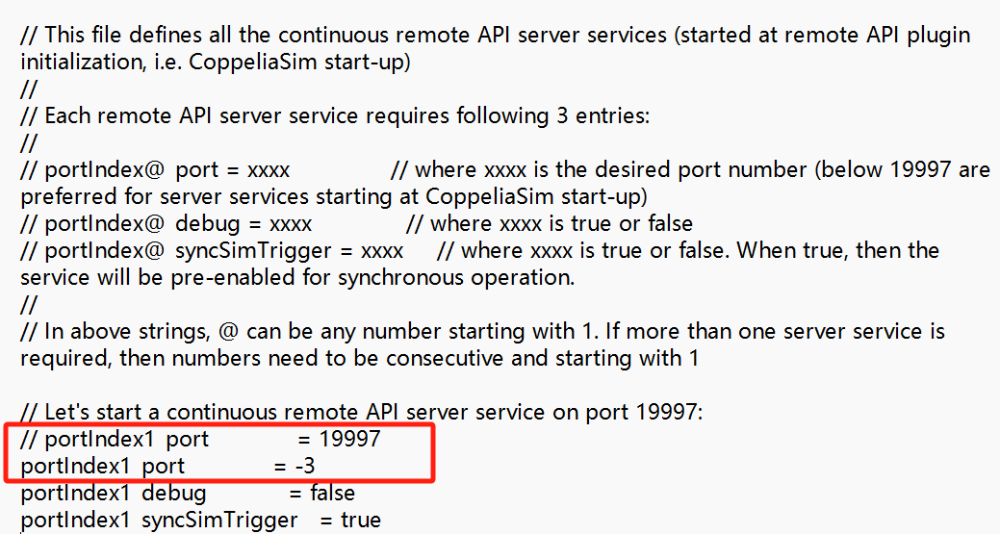
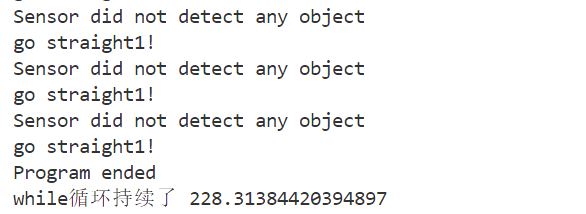
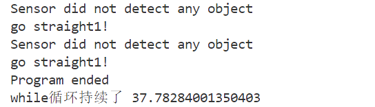

# Python远程控制VREP仿真
机制：Remote API

官方介绍：
Remote API 是其他应用程序与 CoppeliaSim 连接的几种方式之一。 它允许 CoppeliaSim 和外部应用程序（即运行在不同进程或不同机器上的应用程序）之间的通信，是跨平台的，支持服务调用（即阻塞调用），以及双向数据流。

目前三种框架：ZeroMQ-based，legacy remote API，B0-based

## 关于 Legacy remote API

支持语言：C/C++，Python，Java，Matlab/Octave，Lua

远程 API 函数通过socket（或者通过共享内存）与 CoppeliaSim 交互。 

同步/异步工作模式（默认异步）
- 同步模式：VREP端每一次仿真步骤（或循环）都与远程端同步，即，VREP会等待远程端的触发信号，收到信号后才进行下一个仿真步骤。
- 异步模式：VREP端的仿真步骤按照设置的dt间隔进行，不与远程端同步。编程相对简单。

可以远程控制仿真（打开场景，开始、暂停、停止仿真等）

## 实验环境

操作系统：Windows 11 Version 23H2

Python版本：Python 3.11.4 ('base':conda)

## 配置文件

1、确定你的python源文件所在目录，即工作目录。

2、Remote API 功能需要工作目录中有以下三个文件：
```bash
A: sim.py
B: simConst.py
C: remoteApi.dll
```
A和B的位置：
```bash
C:\ProgramFiles\CoppeliaRobotics\CoppeliaSimEdu\programming\remoteApiBindings\python\python\
```
C的位置：
```bash
C:\ProgramFiles\CoppeliaRobotics\CoppeliaSimEdu\programming\remoteApiBindings\lib\lib\Windows
```
把三个文件复制到工作目录。

3、可以正常调用 sim.py 中提供的接口函数与VREP通信了，例如调用 sim.simxStart 等。

## 运行测试
在运行代码之前先使用 CoppeliaSim 打开 scene ([coppelia_bubbleRob.ttt](coppelia_bubbleRob.ttt)) 

可以调用下面的程序进行步进仿真。
```bash
python simpleSynchronousTest.py
```

执行 main.py 函数即可调用远程 API 实现 bubbleRob 小车的直角避障。
```bash
python main.py
```

## 运行结果展示


## 不同工作模式下的运行
将通信机制由socket修改为共享内存机制。
- 将remoteApiConnections.txt文件（C:\Program Files\CoppeliaRobotics\CoppeliaSimEdu目录）中的 portIndex1_port 值修改为任一负整数，例如-3。
- 重启VREP。
- 将python程序中simxStart输入的端口参数修改为相同的负整数。



执行 main2.py 函数即可使用共享内存机制以及数据流的工作模式实现 bubbleRob 小车的直角避障。
```bash
python main2.py
```

这里进行执行速度的对比，下面为使用socket机制以及阻塞式工作模式的执行时间：


下为新的工作模式以及共享内存机制实现的while循环执行时间：



## 使用视觉传感器
取消使用距离传感器，修改基于时间的直角转弯算法。改为使用视觉传感器进行观察，重新设计算法实现小车的直角避障。

运行本部分的代码，实现视觉传感器引导的直角避障，在终端输入下面的指令。
```bash
python main3.py
```


### 算法设计
避障算法能够实现自适应：修改机器人运动速度(在合理范围内)、将障碍物与机器人的初始距离进行调整(在合理范围内) ，避障算法均能正常工作。

#### 图像颜色定位
通过opencv库，实现对区域中红色、蓝色、绿色的部分进行定位，使用红色和蓝色的标识特征对小车的位置进行定位，其中计算出红色、蓝色区域的中心点作为特征定位小车当前的位置，计算出绿色区域的轮廓，作为障碍物而存在。

#### 距离函数的设计
计算沿着小车运动方向到障碍物的距离，只需要抽象成一个简单的数学问题。在前一步得到了障碍物的轮廓(在二维平面抽象成一个长方形)，而小车的运动方向认为是两个特征点(红色与蓝色区域的中心)连接的一条直线，通过直线与线段相交计算小车中心点到交点的距离，使用该短距离作为度量小车距离障碍物的最小距离。

#### 避障逻辑的设计
检测到碰撞，设置以下的一系列参数，作为时间节点控制小车的运动。
```python
if flag == 1: # 检测到碰撞
    signal = 1 # 决定是否需要转弯
    time_to_back = 1 # 决定是否开始倒退
    time_to_straight = 1 # 决定是否开始直行
    time_to_turn_right = 1 # 决定是否开始右转
    time_to_turn_left = 1 # 决定是否开始左转
    straight_time = 150  # 直行的时间步
```
一共有五个时间节点，下面是算法的伪代码：
```python
if signal == 0：
    小车正常直行
elif distance < 40 and time_to_back：
    小车执行后退的操作
elif not near(红的纵坐标，蓝的纵坐标) and time_to_turn_right:
    time_to_back = 0
    小车执行右转操作
elif straight_time > 0 and time_to_straight:
    straight_time = straight_time - 1
    time_to_turn_right = 0
    小车执行直行操作
elif not near(红的横坐标，蓝的横坐标) and time_to_turn_left:
    time_to_straight = 0
    小车执行左转操作
else 流程执行完毕:
    signal = 0
```
## 作者
[Yupeng Zhang](https://github.com/SYSU-Zhangyp)

